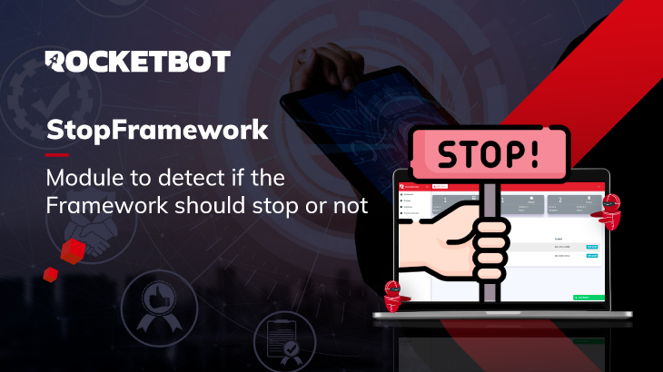

# Rocketbot Stop Framework
  
Module for Rocketbot Stop Framework  

*Read this in other languages: [English](Manual_StopFramework.md), [Português](Manual_StopFramework.pr.md), [Español](Manual_StopFramework.es.md)*
  

## How to install this module
  
To install the module in Rocketbot Studio, it can be done in two ways:
1. Manual: __Download__ the .zip file and unzip it in the modules folder. The folder name must be the same as the module and inside it must have the following files and folders: \__init__.py, package.json, docs, example and libs. If you have the application open, refresh your browser to be able to use the new module.
2. Automatic: When entering Rocketbot Studio on the right margin you will find the **Addons** section, select **Install Mods**, search for the desired module and press install.  

## Description of the commands

### Login NOC
  
Login to NOC using one of the options, API Key, noc.ini file, or credentials.
|Parameters|Description|example|
| --- | --- | --- |
|URL Server|Server URL|https://roc.myrb.io/|
|Select a method to connect to the Orchestrator|Options to login to R.O.C, you can use user credentials, API Key or by selecting noc.ini file|API Key|
|Assign result to a Variable|Variable where the state of the connection will be stored, returns True if it is successful or False otherwise|Variable|

### Should Stop?
  
Check if the framework should stop
|Parameters|Description|example|
| --- | --- | --- |
|ID of the process to check|Variable where the id of the process to be checked if it should stop or not must be entered|J1H8K5DQ4XEW3M9R|
|Process instance|Variable where the process instance must be entered|a2f64d5d9988c|
|Assign result to a Variable|Variable where True or False will be stored depending on whether it should stop or not|Variable|
